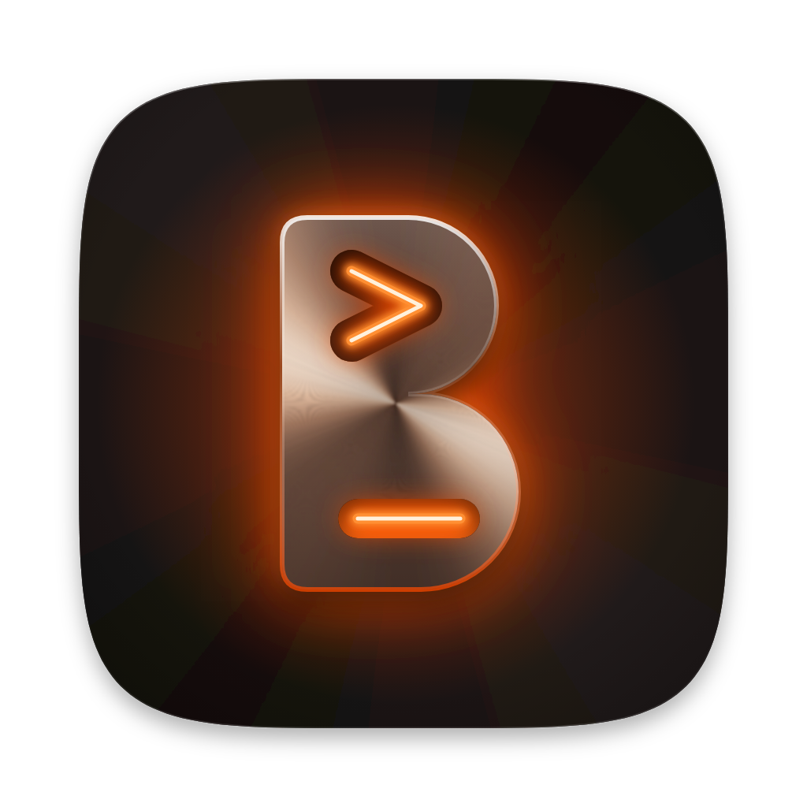
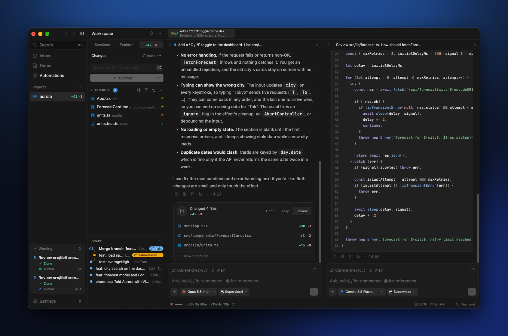
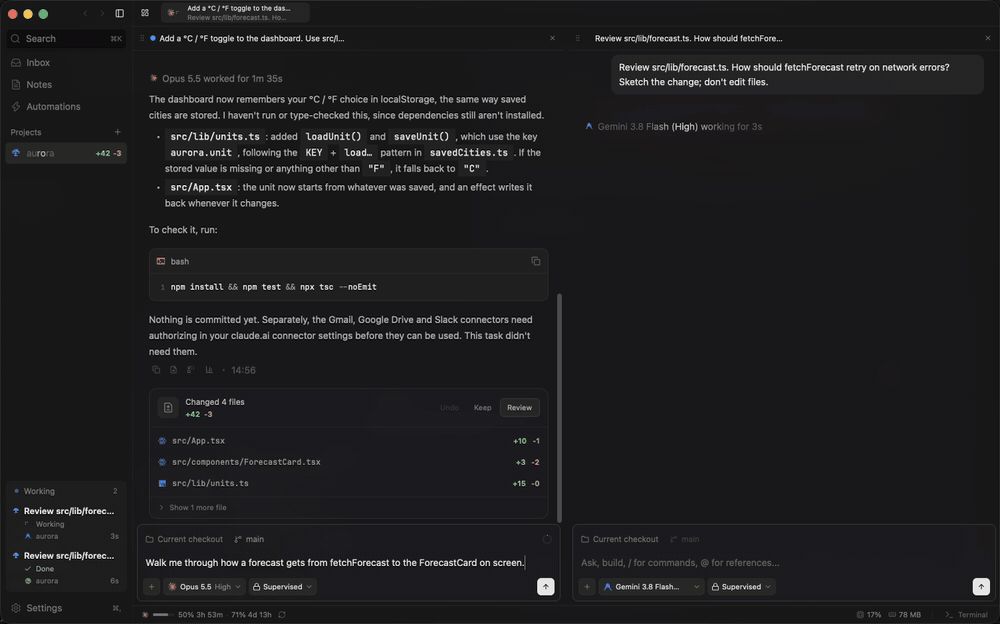
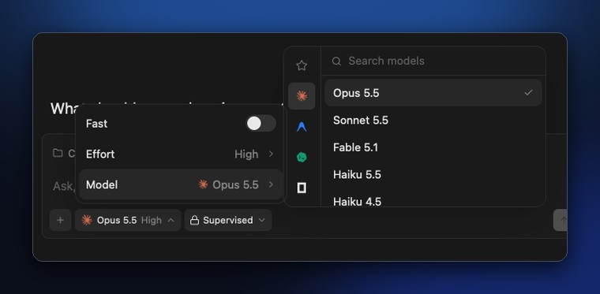
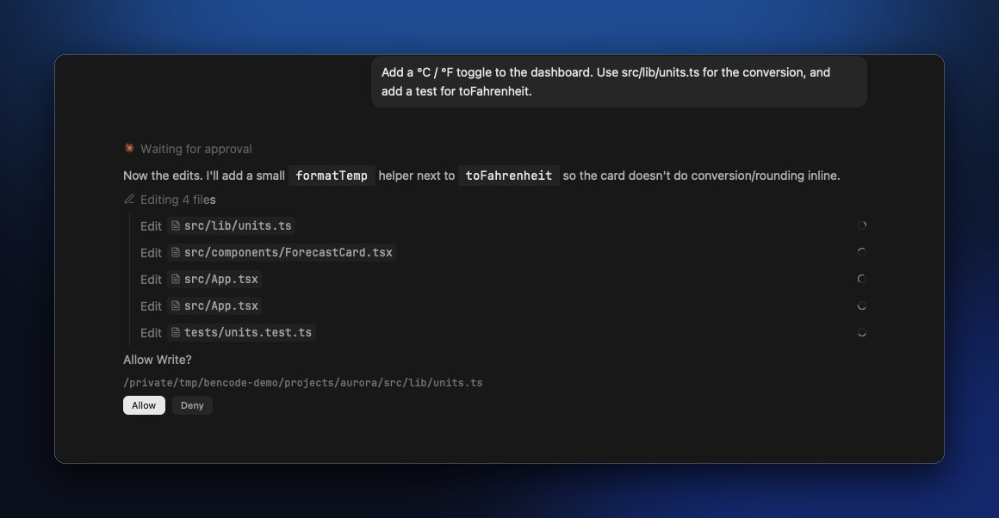
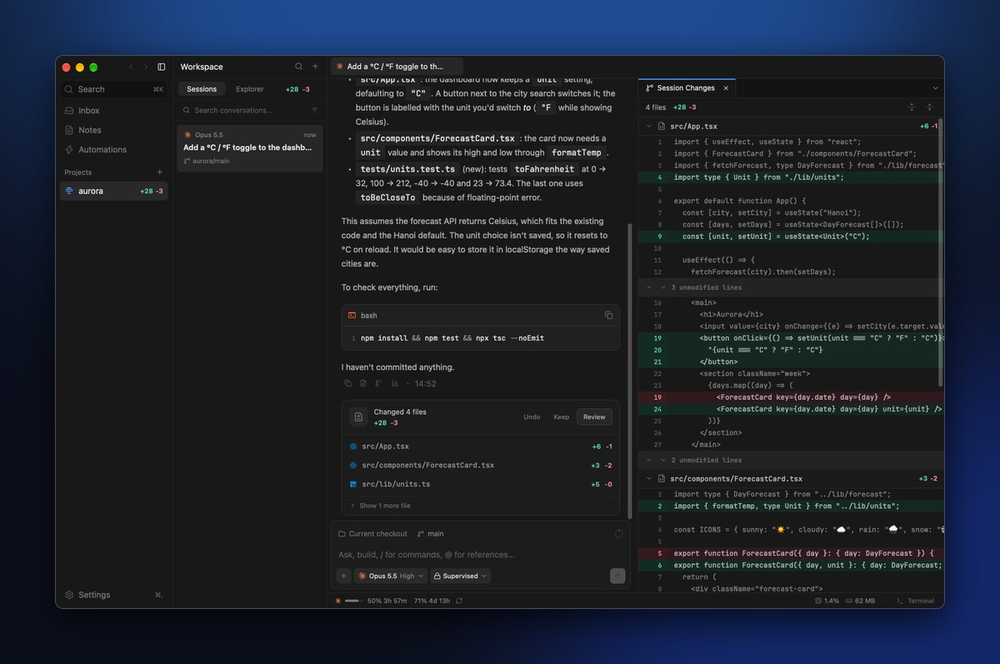
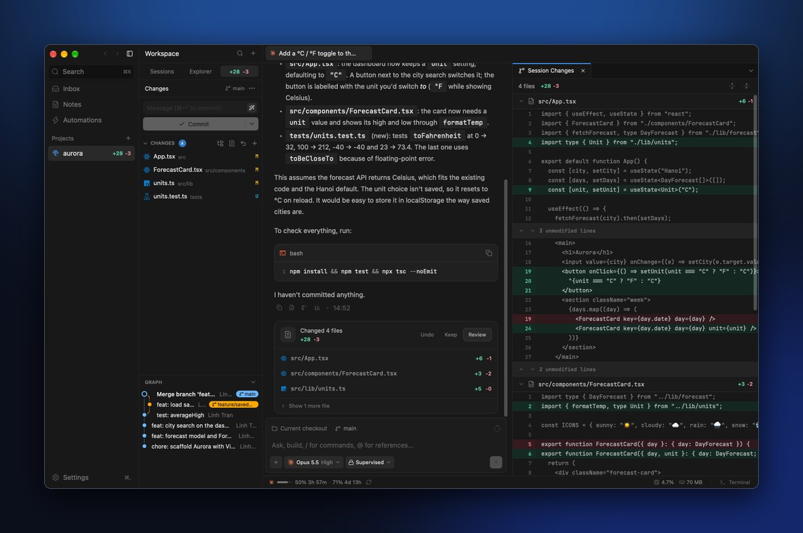
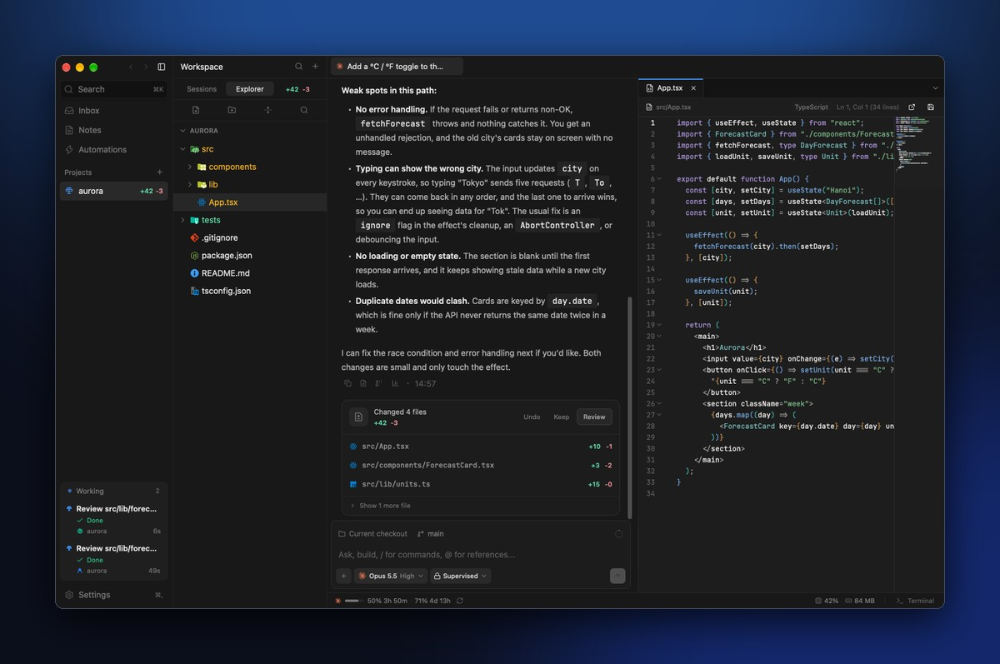
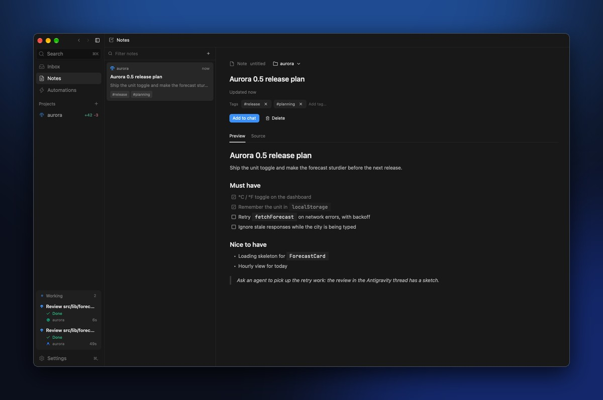
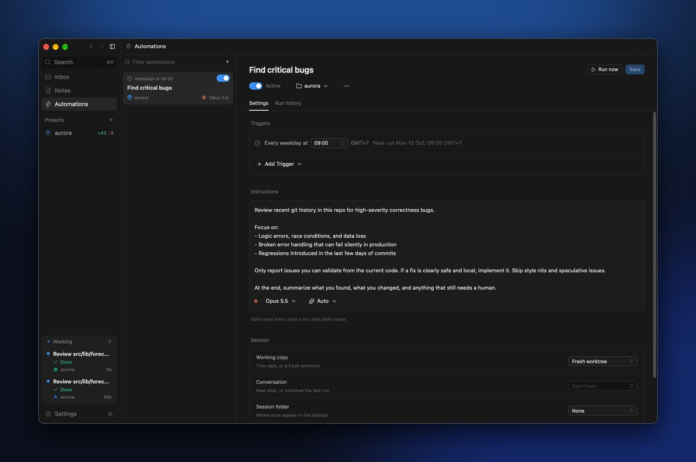

<h1 align="center">
  <a href="https://benitdev.github.io/bencode/"></a> BenCode
</h1>

<p align="center">
  <a href="https://github.com/Benitdev/bencode/stargazers"></a>
  <a href="https://github.com/Benitdev/bencode/releases/latest"></a>
  <a href="https://github.com/Benitdev/bencode/releases"></a>
  
  
  
</p>

<p align="center">
  <sub><a href="../../README.md">English</a> · <b>Tiếng Việt</b></sub>
</p>

<p align="center">
  <strong>Mọi coding agent, trong một cửa sổ native.</strong><br/>
  Chạy Claude Code, Codex, Antigravity và OpenCode song song, cùng file, git, terminal và hộp thư công việc ngay bên cạnh.<br/>
  Không Electron, không web view: mọi pixel đều được vẽ bằng GPU.
</p>

<h3 align="center"><a href="https://github.com/Benitdev/bencode/releases/latest/download/BenCode-arm64.dmg"><ins>Tải cho Apple Silicon</ins></a> · <a href="https://github.com/Benitdev/bencode/releases/latest/download/BenCode-x86_64.dmg"><ins>Intel</ins></a></h3>

<p align="center">
  
</p>

## Tính năng

<table>
<tr>
<td width="50%" valign="middle">

### Nhiều agent song song

Mỗi việc một thread, mỗi thread có agent, model và chế độ quyền riêng. Chia đôi khung chat (⌘D), xếp hàng tin nhắn tiếp theo, dừng một lượt, hoặc chuyển thread sang agent khác. Thẻ **Working** theo dõi mọi lượt đang chạy, ở tất cả project.

</td>
<td width="50%">
  
</td>
</tr>
<tr>
<td width="50%" valign="middle">

### Mọi agent, mọi model

Chọn harness, model, mức effort và chế độ quyền cho từng thread ngay trong ô soạn prompt (⌘.). BenCode điều khiển các CLI bạn đã cài qua stdio, không cần thêm API key và không tốn thêm token nào.

</td>
<td width="50%">
  
</td>
</tr>
<tr>
<td width="50%" valign="middle">

### Duyệt từng bước

Ở chế độ **Supervised**, mỗi lần ghi file hay chạy lệnh shell đều chờ bạn ngay trong transcript, kèm đường dẫn hoặc câu lệnh cụ thể: bấm Allow hoặc Deny, rồi agent làm tiếp.

</td>
<td width="50%">
  
</td>
</tr>
<tr>
<td width="50%" valign="middle">

### Review sau mỗi lượt

Lượt nào sửa file sẽ kết thúc bằng thẻ **Changed N files**. Undo, Keep, hoặc Review đúng những gì thread đó đã thay đổi: các file xếp chồng, tiêu đề dính, phần không đổi được thu gọn.

</td>
<td width="50%">
  
</td>
</tr>
<tr>
<td width="50%" valign="middle">

### Git có sẵn

Stage, discard và commit từ tab Changes, có thể để agent viết commit message. Fetch, pull, push, mở pull request, xem đồ thị commit và làm việc với worktree mà không rời khung chat.

</td>
<td width="50%">
  
</td>
</tr>
<tr>
<td width="50%" valign="middle">

### File, editor và terminal

Explorer với icon Material, code editor native tự nhận biết khi agent sửa file bạn đang mở, Go to File (⌘P), và terminal riêng cho từng project (⌘J), chia đôi được.

</td>
<td width="50%">
  
</td>
</tr>
<tr>
<td width="50%" valign="middle">

### Ghi chú

Ghi chú Markdown có tag và gắn với project, xem dạng Preview hoặc Source, kéo thả ảnh vào, tự lưu. **Add to chat** đưa ghi chú cho agent làm ngữ cảnh.

</td>
<td width="50%">
  
</td>
</tr>
<tr>
<td width="50%" valign="middle">

### Tự động hoá

Prompt chạy theo lịch, từ mẫu có sẵn hoặc tự viết: chọn thời điểm chạy, model và chế độ quyền, mỗi lần chạy trong một worktree mới, và xem lại lịch sử các lần chạy.

</td>
<td width="50%">
  
</td>
</tr>
</table>

**Và còn nữa:**

- **Inbox:** issue và pull request GitHub qua `gh` (checks, bình luận, merge, nhờ agent sửa CI), mỗi project dùng tài khoản `gh` riêng. Issue Nulab Backlog qua API key: bình luận, đổi trạng thái, gửi cho agent.
- **Tài khoản và mức dùng:** nhiều tài khoản Claude Code và Codex, mỗi thread gắn với một tài khoản, mức dùng 5 giờ, tuần và tháng hiện ở thanh dưới cùng. Chuyển qua lại giữa các lần đăng nhập Antigravity đã lưu.
- **Ô soạn prompt:** `@` để nhắc tới file và ghi chú, `/` cho skill và `/mcp`, đính kèm file, sửa và gửi lại prompt vừa rồi.
- **Tìm kiếm (⌘K)** trong thread, file và project; **tìm trong hội thoại (⌘F)** và mục lục các prompt.
- **Sắp xếp:** thư mục thread, ghim, lưu trữ, nhắc việc, mở project bằng VS Code, Cursor, Zed và các editor khác.
- **Tự cập nhật** từ GitHub Releases: rail hiện nút **Update to X**, hoặc dùng **BenCode › Check for Updates…**

---

## Agent được hỗ trợ

BenCode điều khiển CLI của agent qua stdio và đọc luồng JSON mà chúng in ra.

<p>
  <a href="https://docs.anthropic.com/en/docs/claude-code"><kbd> Claude Code</kbd></a> &nbsp;
  <a href="https://github.com/openai/codex"><kbd> Codex</kbd></a> &nbsp;
  <a href="https://antigravity.google/"><kbd> Antigravity</kbd></a> &nbsp;
  <a href="https://opencode.ai/"><kbd> OpenCode</kbd></a>
</p>

## Vì sao native

|  |  |
| :--- | :--- |
| **Không có trình duyệt bên trong** | Rust và [GPUI](https://www.gpui.rs/) của Zed, cùng [Ely GPUI Components](https://elygpui.com/). Không Electron, không Chromium, không WebKit; Metal vẽ toàn bộ giao diện. |
| **Nhanh và nhẹ** | Mục tiêu: khởi động dưới 50ms, dùng khoảng 30MB RAM. Thanh dưới cùng hiện CPU và bộ nhớ của chính BenCode để bạn tự kiểm tra. |
| **Dữ liệu ở máy bạn** | Thread, ghi chú, checkpoint và hồ sơ tài khoản nằm trên Mac của bạn, trong thư mục riêng của BenCode. |
| **Không tốn thêm** | BenCode không cần thêm API key, không tốn thêm token. Nó chạy các CLI bạn đã đăng nhập sẵn. |

BenCode là bản port native của [MonoCode](https://github.com/hardbeat920/monocode) (Tauri + React): cùng tính năng, cùng bố cục, cùng schema cơ sở dữ liệu.

---

## Cài đặt

1. Tải bản phù hợp với máy Mac của bạn (macOS 11 trở lên):
   [`BenCode-arm64.dmg`](https://github.com/Benitdev/bencode/releases/latest/download/BenCode-arm64.dmg)
   cho Apple Silicon (M1 trở về sau), hoặc
   [`BenCode-x86_64.dmg`](https://github.com/Benitdev/bencode/releases/latest/download/BenCode-x86_64.dmg)
   cho Intel. Tất cả các bản có ở [trang releases](https://github.com/Benitdev/bencode/releases).
2. Mở file và kéo **BenCode** vào **Applications**.
3. Bản build chưa được Apple notarize, nên lần mở đầu tiên macOS sẽ hỏi xác
   nhận: mở BenCode một lần, rồi vào **System Settings › Privacy & Security ›
   Open Anyway**. Nếu macOS báo ứng dụng "bị hỏng" (is damaged), chạy:

   ```bash
   xattr -dr com.apple.quarantine /Applications/BenCode.app
   ```

Sau đó BenCode tự cập nhật.

### Yêu cầu

- **macOS 11** trở lên.
- **git** có trong `PATH`.
- Ít nhất một CLI agent đã cài và đăng nhập: `claude`, `agy`, `codex` hoặc `opencode`.
- Tuỳ chọn: **`gh`** (GitHub CLI) cho Inbox và pull request.

Gặp lỗi? **Help › Show Logs** mở file log để bạn đính kèm vào một
[issue](https://github.com/Benitdev/bencode/issues).

<details>
<summary><b>Phím tắt</b></summary>

| Phím | Tác dụng |
| :--- | :--- |
| ⌘T | Thread mới |
| ⌘O | Mở project |
| ⌘K | Tìm kiếm |
| ⌘P | Go to File |
| ⌘F / ⌘G / ⇧⌘G | Tìm trong hội thoại / kết quả sau / kết quả trước |
| ⌘. | Đổi model |
| ⌘S | Lưu file đang mở |
| ⌘W | Đóng tab của file pane (khi pane đó đang focus), nếu không thì đóng thread |
| ⌘B / ⇧⌘B | Ẩn/hiện rail project / sidebar |
| ⌘J / ⌘` | Ẩn/hiện terminal / terminal mới |
| ⌘D / ⇧⌘D | Chia pane sang phải / xuống dưới |
| ⌥⌘←→↑↓ | Chuyển focus giữa các pane |
| ⇧⌘] / ⇧⌘[ | Tab sau / tab trước |
| ⌘] / ⌘[ | Tiến / lùi trong lịch sử tab |
| ⌘, | Cài đặt |
| Esc | Đóng màn hình đang mở |

Mọi phím tắt và menu được khai báo trong `src/app/commands.rs`.

</details>

<details>
<summary><b>Dữ liệu được lưu ở đâu</b></summary>

| Dữ liệu | Đường dẫn |
| :--- | :--- |
| Thread, block, ghi chú, automation, nhắc việc | `~/Library/Application Support/BenCode/bencode.db` |
| Cài đặt của BenCode | `~/Library/Application Support/BenCode/settings.json` |
| Checkpoint để review và hoàn tác thay đổi của agent | `~/Library/Application Support/BenCode/checkpoints` |
| Thư mục cấu hình của từng tài khoản provider | `~/Library/Application Support/BenCode/provider-accounts` |
| Log (khi không chạy từ terminal) | `~/Library/Logs/BenCode/bencode.log` |

BenCode không dùng chung dữ liệu với MonoCode. Ở lần mở đầu tiên, khi chưa có
`bencode.db`, nó sao chép cơ sở dữ liệu, checkpoint và hồ sơ tài khoản của
MonoCode (nếu có) vào thư mục trên, đúng một lần. File của MonoCode chỉ được
đọc, không bao giờ bị sửa.

</details>

---

## Phát triển

```bash
git clone https://github.com/Benitdev/bencode.git
cd bencode
cargo run
```

Bạn cần **Rust** stable mới (edition 2024) và Xcode Command Line Tools. Lần
build đầu mất vài phút vì phải biên dịch GPUI.

```bash
cargo check                  # kiểm tra kiểu nhanh
cargo test                   # unit test
cargo run                    # chạy ứng dụng
cargo build --release        # bản build tối ưu
packaging/macos/bundle.sh    # đóng gói BenCode.app và một dmg cho mỗi kiến trúc (target/bundle)
RUST_LOG=debug cargo run     # bật log
RUST_BACKTRACE=1 cargo run   # in backtrace khi panic
```

> [!NOTE]
> `cargo run` mở dữ liệu thật của BenCode (`bencode.db`), giống hệt bản đã cài.
> Thread, ghi chú và automation bạn thay đổi ở đây là dữ liệu thật.

Kiến trúc, quy tắc UI và những lỗi hay gặp được mô tả chi tiết trong
[`AGENTS.md`](../../AGENTS.md) (tiếng Anh); phần Architecture trong
[README tiếng Anh](../../README.md#developing) tóm tắt cấu trúc thư mục và luồng
xử lý một lượt chat.

### Đóng góp

1. Đọc [`AGENTS.md`](../../AGENTS.md) trước khi sửa code.
2. Khi port một tính năng, đối chiếu với mã nguồn MonoCode trong
   `reference/monocode` (một symlink, không được git theo dõi).
3. Chạy `cargo test`, rồi chạy ứng dụng và thử đúng phần bạn đã sửa.
4. Những gì còn thiếu so với MonoCode được theo dõi trong
   [`docs/migration/PARITY-BACKLOG.md`](../migration/PARITY-BACKLOG.md).

### Phát hành

Push một tag `vX.Y.Z` (khớp với version trong `Cargo.toml`) để GitHub Actions
build `BenCode-arm64.dmg` và `BenCode-x86_64.dmg` rồi đăng một GitHub Release
kèm mục tương ứng trong [`CHANGELOG.md`](../../CHANGELOG.md). Các bước, và cách
bật ký số và notarize khi có Apple Developer ID, nằm trong
[`docs/releasing.md`](../releasing.md).

## Giấy phép

BenCode miễn phí và mã nguồn mở theo [giấy phép MIT](../../LICENSE). Icon
Lucide trong `assets/icons` (ISC) và Material Icon Theme trong
`assets/file-icons` (MIT) giữ giấy phép riêng trong thư mục của chúng; logo các
provider thuộc về chủ sở hữu tương ứng.
